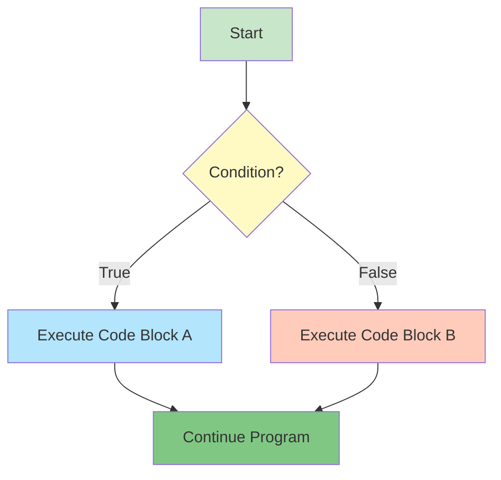

# if, if-else, if-else if Statement, Nested if

---

## 1. What is Decision Making?

**Decision making** (also called conditional execution or branching) allows programs to choose different paths of execution based on conditions. Without decision making, programs would execute the same instructions every time, regardless of the situation.

### Decision Making Flow



### Why Decision Making Matters

| Scenario | Without Decisions | With Decisions |
|----------|-------------------|----------------|
| **User authentication** | Everyone gets access | Only valid users access |
| **Age verification** | No restrictions | Age-appropriate content |
| **Game logic** | Same outcome always | Dynamic gameplay |
| **Error handling** | Program crashes | Graceful error messages |
| **Data validation** | Accept any input | Validate before processing |

---

## 2. The if Statement

The `if` statement executes code only when a condition is true.

### Basic Syntax

```python
if condition:
    # Code to execute if condition is True
    statement1
    statement2
```

### Simple Example

```python
age = 18

if age >= 18:
    print("You are eligible to vote.")
# Output: You are eligible to vote.
```

### How if Works

```python
# Condition evaluates to True
temperature = 35

if temperature > 30:
    print("It's hot outside!")  # This executes
print("Have a nice day!")       # This always executes

# Output:
# It's hot outside!
# Have a nice day!
```

### Multiple Statements in if Block

```python
score = 95

if score >= 90:
    print("Excellent work!")
    print("You got an A grade!")
    grade = "A"
    
print(f"Final grade: {grade}")

# Output:
# Excellent work!
# You got an A grade!
# Final grade: A
```

### Important: Indentation

```python
# CORRECT - Indented block
if True:
    print("This runs")
    print("This also runs")

# WRONG - IndentationError
if True:
print("No indentation!")
```

---

## 3. The if-else Statement

The `if-else` statement provides an alternative path when the condition is false.

### Syntax

```python
if condition:
    # Code if condition is True
    statement1
else:
    # Code if condition is False
    statement2
```

### Basic Example

```python
age = 15

if age >= 18:
    print("You can vote.")
else:
    print("You are too young to vote.")
# Output: You are too young to vote.
```

### Practical Examples

```python
# Even or odd
number = 7

if number % 2 == 0:
    print(f"{number} is even")
else:
    print(f"{number} is odd")
# Output: 7 is odd

# Password check
password = "secret123"

if password == "secret123":
    print("Access granted")
    print("Welcome back!")
else:
    print("Access denied")
    print("Invalid password")
# Output:
# Access granted
# Welcome back!
```

### Assignment with if-else

```python
# Determine pass/fail status
score = 75

if score >= 60:
    status = "Pass"
else:
    status = "Fail"

print(f"Result: {status}")
# Output: Result: Pass
```

---

## 4. The if-elif-else Ladder

Use `elif` (else if) to check multiple conditions in sequence.

### Syntax

```python
if condition1:
    # Code if condition1 is True
elif condition2:
    # Code if condition2 is True
elif condition3:
    # Code if condition3 is True
else:
    # Code if all conditions are False
```

### Grade Assignment Example

```python
score = 85

if score >= 90:
    grade = "A"
elif score >= 80:
    grade = "B"
elif score >= 70:
    grade = "C"
elif score >= 60:
    grade = "D"
else:
    grade = "F"

print(f"Your grade is {grade}")
# Output: Your grade is B
```

### How elif Works

```python
# Only the first True condition executes
x = 15

if x > 20:
    print("Greater than 20")
elif x > 10:
    print("Greater than 10")  # This executes
elif x > 5:
    print("Greater than 5")   # Skipped (even though true)
else:
    print("5 or less")

# Output: Greater than 10
```

### Temperature Categories

```python
temp = 28

if temp >= 30:
    category = "Hot"
    advice = "Stay hydrated!"
elif temp >= 20:
    category = "Warm"
    advice = "Perfect weather!"
elif temp >= 10:
    category = "Cool"
    advice = "Bring a light jacket"
else:
    category = "Cold"
    advice = "Bundle up!"

print(f"Temperature: {temp}°C - {category}")
print(f"Advice: {advice}")

# Output:
# Temperature: 28°C - Warm
# Advice: Perfect weather!
```

### Day of Week Example

```python
day = 3  # 0=Monday, 6=Sunday

if day == 0:
    day_name = "Monday"
elif day == 1:
    day_name = "Tuesday"
elif day == 2:
    day_name = "Wednesday"
elif day == 3:
    day_name = "Thursday"
elif day == 4:
    day_name = "Friday"
elif day == 5:
    day_name = "Saturday"
elif day == 6:
    day_name = "Sunday"
else:
    day_name = "Invalid day"

print(f"Day {day} is {day_name}")
# Output: Day 3 is Thursday
```

---

## 5. Nested if Statements

Place `if` statements inside other `if` statements to create hierarchical decisions.

### Basic Nesting

```python
age = 20
has_license = True

if age >= 18:
    if has_license:
        print("You can drive.")
    else:
        print("You need to get a license first.")
else:
    print("You are too young to drive.")

# Output: You can drive.
```

### Multiple Levels of Nesting

```python
age = 25
has_license = True
has_car = False

if age >= 18:
    print("Age requirement met")
    
    if has_license:
        print("License verified")
        
        if has_car:
            print("You can drive your car")
        else:
            print("You need to rent or borrow a car")
    else:
        print("Please get a license")
else:
    print("Too young to drive")

# Output:
# Age requirement met
# License verified
# You need to rent or borrow a car
```

### Nested if-else

```python
score = 85
attendance = 95

if score >= 80:
    if attendance >= 90:
        print("Excellent student!")
        grade = "A"
    else:
        print("Good score but poor attendance")
        grade = "B"
else:
    if attendance >= 90:
        print("Good attendance but needs to improve score")
        grade = "C"
    else:
        print("Needs improvement in both areas")
        grade = "D"

print(f"Final grade: {grade}")
# Output:
# Excellent student!
# Final grade: A
```

---

## 6. Logical Operators (and, or, not)

Combine multiple conditions using logical operators.

### The and Operator

```python
# Both conditions must be True
age = 25
has_license = True

if age >= 18 and has_license:
    print("You can drive")
# Output: You can drive

# Replacing nested if
# Instead of:
if age >= 18:
    if has_license:
        print("Can drive")

# Use:
if age >= 18 and has_license:
    print("Can drive")
```

### The or Operator

```python
# At least one condition must be True
day = "Saturday"

if day == "Saturday" or day == "Sunday":
    print("It's the weekend!")
# Output: It's the weekend!

# Multiple conditions
weather = "rainy"

if weather == "rainy" or weather == "snowy" or weather == "stormy":
    print("Stay indoors")
# Output: Stay indoors
```

### The not Operator

```python
# Reverses the condition
is_raining = False

if not is_raining:
    print("You don't need an umbrella")
# Output: You don't need an umbrella

# With comparison
age = 15

if not age >= 18:
    print("Under 18")
# Output: Under 18

# Better written as:
if age < 18:
    print("Under 18")
```

### Combining Operators

```python
# and, or, not together
age = 22
has_license = True
has_insurance = False

if age >= 18 and has_license and has_insurance:
    print("Can drive legally")
elif age >= 18 and has_license and not has_insurance:
    print("Need insurance to drive")
else:
    print("Cannot drive")

# Output: Need insurance to drive
```

### Operator Precedence

```python
# not > and > or
a = True
b = False
c = True

# Evaluated as: a and (not b) or c
result = a and not b or c
print(result)  # True

# Use parentheses for clarity
result = (a and (not b)) or c
print(result)  # True
```

---

## 7. Conditional Expression (Ternary Operator)

A one-line shorthand for simple if-else statements.

### Syntax

```python
value_if_true if condition else value_if_false
```

### Basic Example

```python
age = 20
status = "adult" if age >= 18 else "minor"
print(status)  # Output: adult

# Equivalent to:
if age >= 18:
    status = "adult"
else:
    status = "minor"
```

### Practical Uses

```python
# Determine max value
a = 10
b = 20
maximum = a if a > b else b
print(f"Max: {maximum}")  # Output: Max: 20

# Greeting based on time
hour = 14
greeting = "Good morning" if hour < 12 else "Good afternoon"
print(greeting)  # Output: Good afternoon

# Discount calculation
price = 100
is_member = True
final_price = price * 0.9 if is_member else price
print(f"Price: ${final_price}")  # Output: Price: $90.0
```

### Nested Ternary (Use Sparingly)

```python
# Can be hard to read
score = 85
grade = "A" if score >= 90 else "B" if score >= 80 else "C"
print(grade)  # Output: B

# Better as regular if-elif
if score >= 90:
    grade = "A"
elif score >= 80:
    grade = "B"
else:
    grade = "C"
```

---

## 8. Truthy and Falsy Values

Any value can be used in conditions. Python evaluates values as True (truthy) or False (falsy).

### Falsy Values

```python
# These evaluate to False:
# - False
# - None
# - 0 (integer zero)
# - 0.0 (float zero)
# - "" (empty string)
# - [] (empty list)
# - () (empty tuple)
# - {} (empty dictionary)

if 0:
    print("This won't print")

if "":
    print("This won't print")

if []:
    print("This won't print")
```

### Truthy Values

```python
# Everything else is truthy
if 1:
    print("Non-zero numbers are truthy")

if "hello":
    print("Non-empty strings are truthy")

if [1, 2, 3]:
    print("Non-empty lists are truthy")

# All print!
```

### Practical Usage

```python
# Check if string is not empty
name = "Alice"

if name:  # Cleaner than: if name != ""
    print(f"Hello, {name}!")

# Check if list has items
items = [1, 2, 3]

if items:  # Cleaner than: if len(items) > 0
    print(f"Processing {len(items)} items")

# Check if value exists
value = None

if value:
    print("Value exists")
else:
    print("Value is None or falsy")
# Output: Value is None or falsy
```

---

## 9. Practical Examples

### Example 1: Login System

```python
username = input("Username: ")
password = input("Password: ")

if username == "admin" and password == "secret123":
    print("Login successful!")
    print("Welcome, Administrator")
elif username == "admin":
    print("Incorrect password")
else:
    print("Unknown username")
```

### Example 2: BMI Calculator

```python
weight = float(input("Weight (kg): "))
height = float(input("Height (m): "))

bmi = weight / (height ** 2)

if bmi < 18.5:
    category = "Underweight"
    advice = "Consider consulting a nutritionist"
elif bmi < 25:
    category = "Normal weight"
    advice = "Keep up the good work!"
elif bmi < 30:
    category = "Overweight"
    advice = "Consider a balanced diet and exercise"
else:
    category = "Obese"
    advice = "Please consult a healthcare provider"

print(f"\nBMI: {bmi:.1f}")
print(f"Category: {category}")
print(f"Advice: {advice}")
```

### Example 3: Leap Year Calculator

```python
year = int(input("Enter a year: "))

# A year is a leap year if:
# - Divisible by 4 AND
# - Not divisible by 100, OR divisible by 400

if year % 4 == 0:
    if year % 100 == 0:
        if year % 400 == 0:
            print(f"{year} is a leap year")
        else:
            print(f"{year} is not a leap year")
    else:
        print(f"{year} is a leap year")
else:
    print(f"{year} is not a leap year")

# Or more concisely:
if (year % 4 == 0 and year % 100 != 0) or (year % 400 == 0):
    print(f"{year} is a leap year")
else:
    print(f"{year} is not a leap year")
```

### Example 4: Shopping Discount

```python
total_amount = float(input("Enter total amount: $"))
is_member = input("Are you a member? (yes/no): ").lower() == "yes"
is_first_purchase = input("First purchase? (yes/no): ").lower() == "yes"

discount = 0

if is_member and is_first_purchase:
    discount = 0.20  # 20% discount
    print("Member + First Purchase: 20% discount!")
elif is_member:
    discount = 0.10  # 10% discount
    print("Member: 10% discount!")
elif is_first_purchase:
    discount = 0.05  # 5% discount
    print("First Purchase: 5% discount!")
else:
    print("No discount applied")

if total_amount >= 100:
    discount += 0.05  # Extra 5% for purchases over $100
    print("Orders over $100: Extra 5% discount!")

final_amount = total_amount * (1 - discount)
savings = total_amount - final_amount

print(f"\nOriginal Amount: ${total_amount:.2f}")
print(f"Discount: {discount * 100:.0f}%")
print(f"You saved: ${savings:.2f}")
print(f"Final Amount: ${final_amount:.2f}")
```

### Example 5: Grade with Pass/Fail

```python
score = int(input("Enter your score (0-100): "))
attendance = int(input("Enter attendance percentage: "))

# Validation
if score < 0 or score > 100:
    print("Invalid score! Must be 0-100")
elif attendance < 0 or attendance > 100:
    print("Invalid attendance! Must be 0-100")
else:
    # Calculate grade
    if score >= 90:
        grade = "A"
    elif score >= 80:
        grade = "B"
    elif score >= 70:
        grade = "C"
    elif score >= 60:
        grade = "D"
    else:
        grade = "F"
    
    # Check pass/fail
    if score >= 60 and attendance >= 75:
        result = "Pass"
        print(f"Grade: {grade} - {result}")
    elif score >= 60:
        result = "Fail (Low Attendance)"
        print(f"Grade: {grade} - {result}")
        print("Attendance below 75%")
    elif attendance >= 75:
        result = "Fail (Low Score)"
        print(f"Grade: {grade} - {result}")
        print("Score below 60")
    else:
        result = "Fail"
        print(f"Grade: {grade} - {result}")
        print("Both score and attendance are low")
```

---

## 10. Common Mistakes

### Mistake 1: Using = Instead of ==

```python
# WRONG - Assignment, not comparison
x = 5
if x = 5:  # SyntaxError
    print("Five")

# CORRECT - Use == for comparison
if x == 5:
    print("Five")
```

### Mistake 2: Forgetting the Colon

```python
# WRONG - Missing colon
if x > 5
    print("Greater than 5")  # SyntaxError

# CORRECT - Colon required
if x > 5:
    print("Greater than 5")
```

### Mistake 3: Incorrect Indentation

```python
# WRONG - No indentation
if True:
print("Hello")  # IndentationError

# WRONG - Inconsistent indentation
if True:
    print("Line 1")
      print("Line 2")  # IndentationError

# CORRECT - Consistent indentation
if True:
    print("Line 1")
    print("Line 2")
```

### Mistake 4: Incorrect Chained Comparisons

```python
# WRONG - Doesn't work as expected
x = 5
if x == 3 or 5:  # Always True!
    print("Wrong logic")

# CORRECT - Be explicit
if x == 3 or x == 5:
    print("Correct logic")
```

### Mistake 5: Using Multiple Conditions When One Suffices

```python
# WRONG - Redundant
x = 10
if x > 5:
    if x > 3:  # Already know x > 5, so x > 3 is always True
        print("Greater than 3")

# CORRECT - Single condition
if x > 5:
    print("Greater than 3")
```

---

## 11. Best Practices

### 1. Keep Conditions Simple

```python
# GOOD - Simple and readable
if age >= 18 and has_license:
    print("Can drive")

# AVOID - Too complex
if (age >= 18 and age < 100 and has_license and not is_suspended 
    and insurance_valid and car_working):
    print("Can drive")

# BETTER - Break into steps
is_old_enough = age >= 18 and age < 100
can_legally_drive = has_license and not is_suspended
car_ready = insurance_valid and car_working

if is_old_enough and can_legally_drive and car_ready:
    print("Can drive")
```

### 2. Use elif Instead of Multiple if

```python
# AVOID - Checks all conditions
score = 85
if score >= 90:
    grade = "A"
if score >= 80:  # Still checks even though 85 < 90
    grade = "B"
if score >= 70:  # Still checks
    grade = "C"

# GOOD - Stops at first match
if score >= 90:
    grade = "A"
elif score >= 80:
    grade = "B"
elif score >= 70:
    grade = "C"
```

### 3. Order Conditions Properly

```python
# WRONG - Never reaches specific condition
if score >= 60:
    grade = "D"
elif score >= 90:  # Never reached!
    grade = "A"

# CORRECT - Most restrictive first
if score >= 90:
    grade = "A"
elif score >= 60:
    grade = "D"
```

### 4. Use Logical Operators Instead of Deep Nesting

```python
# AVOID - Deep nesting
if age >= 18:
    if has_license:
        if has_insurance:
            print("Can drive")

# GOOD - Logical operators
if age >= 18 and has_license and has_insurance:
    print("Can drive")
```

### 5. Validate Input Early

```python
# GOOD - Validate first
score = int(input("Score: "))

if score < 0 or score > 100:
    print("Invalid score")
else:
    # Process valid score
    if score >= 60:
        print("Pass")
    else:
        print("Fail")
```

---

## 12. Summary

### Conditional Statements Quick Reference

| Statement | Purpose | Example |
|-----------|---------|---------|
| `if` | Execute if condition is True | `if x > 5: print("Yes")` |
| `if-else` | Choose between two paths | `if x > 5: ... else: ...` |
| `if-elif-else` | Choose among multiple paths | `if x > 10: ... elif x > 5: ... else: ...` |
| `Nested if` | Decisions within decisions | `if age > 18: if license: ...` |
| `and` | Both conditions True | `if age > 18 and license: ...` |
| `or` | At least one True | `if day == "Sat" or day == "Sun": ...` |
| `not` | Reverse condition | `if not raining: ...` |
| `Ternary` | One-line if-else | `status = "adult" if age >= 18 else "minor"` |

### Truthy and Falsy Values

**Falsy:** `False`, `None`, `0`, `0.0`, `""`, `[]`, `()`, `{}`  
**Truthy:** Everything else

### Key Takeaways

1. **if executes code only when True** - single path
2. **if-else provides alternative** - two paths
3. **elif checks multiple conditions** - many paths
4. **Order matters in elif** - first True wins
5. **Nested if for hierarchical decisions** - avoid deep nesting
6. **Logical operators combine conditions** - cleaner than nesting
7. **Ternary for simple assignments** - one-line shorthand
8. **Any value can be condition** - truthy/falsy evaluation
9. **Use == for comparison** - not =
10. **Indentation is crucial** - defines code blocks

---

## References

- **Control Flow**: [https://docs.python.org/3/tutorial/controlflow.html](https://docs.python.org/3/tutorial/controlflow.html)
- **Boolean Operations**: [https://docs.python.org/3/library/stdtypes.html#boolean-operations-and-or-not](https://docs.python.org/3/library/stdtypes.html#boolean-operations-and-or-not)
- **Truth Value Testing**: [https://docs.python.org/3/library/stdtypes.html#truth-value-testing](https://docs.python.org/3/library/stdtypes.html#truth-value-testing)
